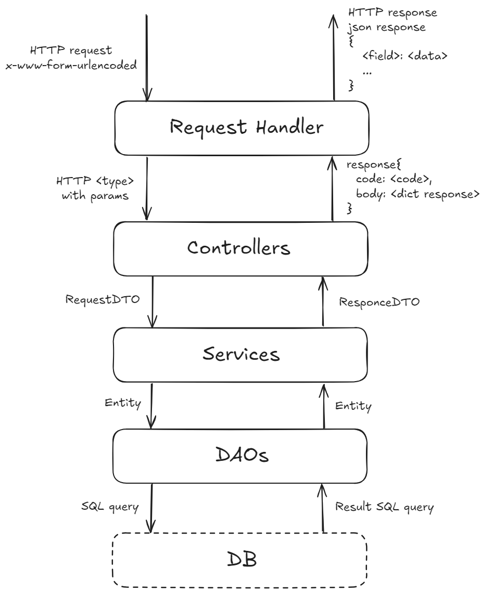

# Обмен валют 

REST API для описания валют и обменных курсов.   
Позволяет просматривать и редактировать списки валют и обменных курсов, и совершать расчёт конвертации произвольных сумм из одной валюты в другую.  

Проект создан в рамках **Python Roadmap Сергея Жукова** -> [ссылка](https://zhukovsd.github.io/python-backend-learning-course/)


<p align="center">
  
</p>

## Запуск проекта
1. Выполните клонирование проекта `git@github.com:Wh4tisl0ve/Currency_exchange.git`
2. Запустите скрипт выполнив `python3 run.py` в терминале.
3. Импортируйте коллекцию постман [CurrencyExchange.postman_collection.json](src/postman-collections/CurrencyExchange.postman_collection.json)
4. Выполните предложенные HTTP запросы в Postman или перейдите по адресу http://127.0.0.1:8080.

## Описание эндпоинтов
* `Get` -> `/currencies` -> Получение списка валют  

Пример ответа:
```
[
    {
        "id": 0,
        "name": "United States dollar",
        "code": "USD",
        "sign": "$"
    },   
    {
        "id": 0,
        "name": "Euro",
        "code": "EUR",
        "sign": "€"
    }
]
```
* `Get` -> `/currency/EUR` -> Получение конкретной валюты  

Пример ответа:
```
{
    "id": 0,
    "name": "Euro",
    "code": "EUR",
    "sign": "€"
}
```
* `POST` -> `/currencies` -> Добавление новой валюты в базу. Данные передаются в теле запроса в виде полей формы (x-www-form-urlencoded). Поля формы - `name`, `code`, `sign`  

Пример ответа:
```
{
    "id": 0,
    "name": "Euro",
    "code": "EUR",
    "sign": "€"
}
```
* `GET` -> `/exchangeRates` -> Получение списка всех обменных курсов  

Пример ответа:
```
[
    {
        "id": 0,
        "baseCurrency": {
            "id": 0,
            "name": "United States dollar",
            "code": "USD",
            "sign": "$"
        },
        "targetCurrency": {
            "id": 1,
            "name": "Euro",
            "code": "EUR",
            "sign": "€"
        },
        "rate": 0.99
    }
]
```
* `GET` -> `/exchangeRate/USDRUB` -> Получение конкретного обменного курса. Валютная пара задаётся идущими подряд кодами валют в адресе запроса  

Пример ответа:
```
{
    "id": 0,
    "baseCurrency": {
        "id": 0,
        "name": "United States dollar",
        "code": "USD",
        "sign": "$"
    },
    "targetCurrency": {
        "id": 1,
        "name": "Euro",
        "code": "EUR",
        "sign": "€"
    },
    "rate": 0.99
}
```
* `POST` -> `/exchangeRates` -> Добавление нового обменного курса в базу. Данные передаются в теле запроса в виде полей формы (x-www-form-urlencoded). Поля формы - `baseCurrencyCode`, `targetCurrencyCode`, `rate`  

Пример ответа:
```
{
    "id": 0,
    "baseCurrency": {
        "id": 0,
        "name": "United States dollar",
        "code": "USD",
        "sign": "$"
    },
    "targetCurrency": {
        "id": 1,
        "name": "Euro",
        "code": "EUR",
        "sign": "€"
    },
    "rate": 0.99
}
```
* `PATCH` -> `/exchangeRate/USDRUB` -> Обновление существующего в базе обменного курса. Валютная пара задаётся идущими подряд кодами валют в адресе запроса. Данные передаются в теле запроса в виде полей формы (x-www-form-urlencoded). Единственное поле формы - rate. 

Пример ответа:
```
{
    "id": 0,
    "baseCurrency": {
        "id": 0,
        "name": "United States dollar",
        "code": "USD",
        "sign": "$"
    },
    "targetCurrency": {
        "id": 1,
        "name": "Euro",
        "code": "EUR",
        "sign": "€"
    },
    "rate": 0.99
}
```
* `GET` -> `/exchange?from=BASE_CURRENCY_CODE&to=TARGET_CURRENCY_CODE&amount=$AMOUNT` -> Расчёт перевода определённого количества средств из одной валюты в другую

Пример ответа:
```
{
    "baseCurrency": {
        "id": 0,
        "name": "United States dollar",
        "code": "USD",
        "sign": "$"
    },
    "targetCurrency": {
        "id": 1,
        "name": "Australian dollar",
        "code": "AUD",
        "sign": "A€"
    },
    "rate": 1.45,
    "amount": 10.00,
    "convertedAmount": 14.50
}
```

## Архитектура проекта
С целью разделения ответственности слоев была выбрана многослойная архитектура. 



## Стек 

* Python 3.11
* http.server
* SQLite